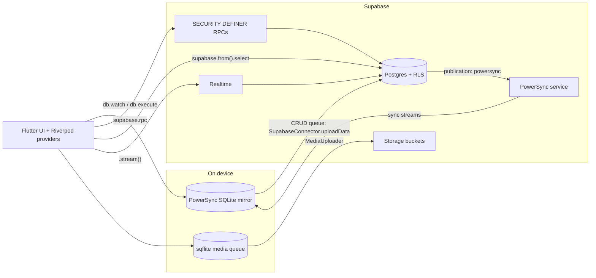

# Architecture Overview

**Owner:** Author A (Core)
**Reviewers:** Author B, Author C, Author D
**Last verified against:** migrations up to `20260927093935_recurring_orders_rpc.sql`, sync-config (path unconfirmed)

## 1. Purpose

GreenYield is a Flutter marketplace connecting **farmers**, **buyers** and **delivery drivers** in Sri Lanka (currency LKR; languages en/si/ta). This document describes the one architectural decision every other doc depends on: **the app has two data paths**, and which one a feature uses is dictated by Row Level Security (RLS).

Other docs:
- Read/write plumbing: [data-access.md](data-access.md)
- Sync streams, publication, mirror columns: [powersync-sync-and-mirrors.md](powersync-sync-and-mirrors.md)
- Adding a table: [add-a-synced-table.md](add-a-synced-table.md)
- Auth gate and roles: [auth-and-roles.md](auth-and-roles.md)
- Cross-area features: [../cross-cutting.md](../cross-cutting.md)

## 2. Stack

| Layer | Technology | Where |
|---|---|---|
| UI / state | Flutter, `flutter_riverpod` ^3.4.2 | `lib/features/**`, providers |
| Backend | Supabase: Postgres 17, Auth, Storage, Realtime, RPCs, RLS, PostGIS, pg_trgm, pg_cron | `supabase/migrations/**`, `supabase/config.toml` |
| Offline sync | PowerSync (`powersync` ^2.3.3), local SQLite at `<appSupportDir>/greenyield.db` | `lib/core/local_db/**` |
| Media queue | `sqflite` at `<appSupportDir>/media_queue.db` | `lib/core/media/**` |
| i18n | `easy_localization` with a merged multi-file loader | `lib/core/localization/**` |
| Prefs | `shared_preferences` (theme, marketplace cache, driver shift flag) | various |
| Maps / location | `flutter_map`, `latlong2`, `geolocator`, `geocoding` | `lib/core/location/**` |

## 3. Key concept: the two data paths

**Path 1: PowerSync local mirror (offline-first).** Screens read with `db.watch(...)` / `db.getAll(...)` against local SQLite. Writes are local `INSERT/UPDATE/DELETE` statements that PowerSync queues and `SupabaseConnector.uploadData` replays to Supabase via PostgREST.

**Path 2: Supabase directly (online only).** RPCs, PostgREST selects, Realtime streams and Storage calls.

### Why two paths (RLS)

`profile` was created with own-row-only RLS (`profile_select_own`, `20260815155858_generic_profile.sql`), and `farmer_crop` likewise. The sync streams follow the same rule: `own_profile` is `WHERE id = auth.user_id()`, so **only the signed-in user's own `profile` row is ever synced**. Anything that needs another user's name, avatar, phone, coordinates or address cannot be served from the local mirror.

Two things exist to bridge this:
1. `SECURITY DEFINER` RPCs that return an explicit, safe column list (marketplace RPCs, `get_farmer_public_profile`, `get_order_detail`, `get_driver_today_stops`, chat RPCs).
2. Denormalised snapshots stored on rows the user can already read: `delivery.farmer_display_name` / `buyer_display_name`, and `conversation_participant.display_name` / `avatar_url` / `role`.

> Note: RLS on `profile` was later widened (`profile_select_order_participants`, last defined in `20260915130000_fix_orders_rls_recursion.sql`). That affects Supabase API/PostgREST reads only. The PowerSync stream `own_profile` was not widened, so the mirror is still own-row only.

> ⚠ Unverified: the final `profile_select_order_participants` policy has a second clause, `exists (select 1 from delivery_assignment da where da.driver_profile_id = auth.uid() and da.is_current = true)`, that is **not tied to `profile.id`**. Read literally, any driver with a current assignment can select every `profile` row through the API. Confirm whether this is intended; see `VERIFY.md` (Author A).

## 4. Which path each feature uses

| Feature | Reads | Writes |
|---|---|---|
| Own profile, roles, role profiles (buyer/farmer/driver), vehicles, route preferences | PowerSync | PowerSync CRUD upload |
| Crop catalogue (`crop`) | PowerSync (read-only) | none |
| Farmer's own listings (`ProduceListingService.watchOwnListings`) | PowerSync | local insert, uploaded |
| Cart | PowerSync (joined to local `produce_listing`, `crop`, `farmer_crop`) | PowerSync CRUD upload |
| Marketplace search / detail / farmer discovery | RPC (`search_marketplace_listings`, `get_marketplace_listing`, `list_marketplace_farmers`) plus a 24 h `SharedPreferences` fallback cache | none |
| Farmer public profile and per-crop batches | RPC (`get_farmer_public_profile`, `get_farmer_crop_listings`) | none |
| Checkout | n/a | RPC `place_checkout` |
| Buyer / farmer order lists | PowerSync local joins (`orders`, `order_item`, `delivery`, ...) | RPC (`mark_order_packed`, `cancel_order`) |
| Order detail | local `watch` used only as a change trigger, then RPC `get_order_detail`; local SQL fallback on failure | none |
| Driver deliveries list and calendar | PostgREST select on `delivery_assignment` with embedded joins; the "watch" methods yield **once** | RPC `transition_delivery_status` |
| Driver home stops | RPC `get_driver_today_stops`, refetched on demand | RPC `transition_delivery_status`, `start_driver_shift` |
| Wallet balance / transactions | PowerSync (read-only) | RPC `topup_wallet` (all other wallet writes happen inside SQL functions) |
| Farmer reviews | PowerSync (own reviews only) | RPC `submit_farmer_review` |
| Notifications | PowerSync | local `UPDATE read_at` / `DELETE`, uploaded; inserts are backend-only |
| Pricing rules, market price, trend, history | PowerSync (read-only streams) | none |
| Chat | Supabase Realtime `.stream()` + RPCs | direct `insert` into `message`, `update` of `last_read_at` |
| Media (avatars, crop/listing photos) | Storage via signed URL + disk cache | sqflite queue, drained by `MediaUploader` |

## 5. Write rules (summary; details in [data-access.md](data-access.md))

- Tables with client RLS write policies are written locally and uploaded generically.
- Tables written **only** through RPCs or SQL functions: `orders`, `order_item`, `payment`, `checkout_request` (via `place_checkout`); `delivery`, `delivery_assignment` (via `assign_nearest_driver`); `farmer_review` (via `submit_farmer_review`); `wallet`, `wallet_transaction` (via `apply_wallet_transaction`); `notification` inserts (via `send_notification` / triggers).
- Direct client inserts into `orders`, `order_item` and `payment` are disabled: the `orders_insert_buyer` policy was dropped in `20260905000001_disable_direct_order_writes.sql`, and `order_item` / `payment` never had a client insert policy.

## 6. Startup sequence (`lib/main.dart`)

1. `WidgetsBinding.ensureInitialized()`
2. `EasyLocalization.ensureInitialized()`
3. `initSupabase()`: loads `.env` (`SUPABASE_URL`, `SUPABASE_PUBLISHABLE_KEY`), calls `Supabase.initialize`.
4. `initPowerSync()`: opens `greenyield.db`, `db.initialize()`, connects with `SupabaseConnector` if a session exists, and registers an auth listener (see §7).
5. A `ProviderContainer` is created manually, and `themeModeProvider.notifier.loadSavedTheme()` runs before `runApp`.
6. `runApp(UncontrolledProviderScope(... EasyLocalization(... GreenYieldApp)))`; `home: AuthGate()`.

`MediaUploader.instance.start()` is **not** called here (see §9).

## 7. PowerSync lifecycle (`lib/core/local_db/powersync.dart`)

| Auth event | Action |
|---|---|
| App start with an existing session | `db.connect(SupabaseConnector())` |
| `signedIn`, `tokenRefreshed` | `db.connect(SupabaseConnector())` again |
| `signedOut` | `db.disconnectAndClear()` |

`SupabaseConnector.fetchCredentials()` returns `POWERSYNC_URL` (from `.env`) and the current Supabase **access token**. Sync streams use `auth.user_id()` from that JWT.

## 8. Layering conventions

- `lib/core/**`: cross-cutting infrastructure (auth, local_db, media, roles, theme, localization, storage, location, supabase client).
- `lib/models/**`: plain Dart models with `fromMap` / `toInsertMap`.
- `lib/features/<feature>/**`: services (data access, no UI), Riverpod providers, and presentation (out of scope for these docs).
- Riverpod usage observed: `Provider` (service singletons), `StreamProvider(.family, .autoDispose)` (watch streams), `FutureProvider.autoDispose.family` (RPC reads), `NotifierProvider` (theme, nav-tab index, shift-started flag, notification list). Several services are `const` classes instantiated directly rather than through a provider.
- Role wiring: `roleScreensRegistry` (profile completion checks) and `buildNavShellForRole` (tab sets). See [auth-and-roles.md](auth-and-roles.md).

## 9. Edge cases and failure modes

| Situation | Behaviour (from code) |
|---|---|
| First launch offline | `ownProfileProvider` awaits `db.waitForFirstSync()`, so AuthGate shows a spinner until a first sync completes. |
| Sign-out with un-uploaded local writes | `disconnectAndClear()` clears the local DB, including the pending CRUD queue. Unsynced writes are lost. |
| Token refresh | `db.connect` is invoked again on every `tokenRefreshed`. |
| Marketplace offline | RPC fails; `MarketplaceCache` (24 h, `SharedPreferences`) can serve the last search. |
| Order detail offline | RPC fails, falls back to `_fetchOrderDetailLocally`, where cross-user names are only available via the denormalised `delivery` columns. |
| Driver screens offline | They call PostgREST directly and yield once, so they need a connection despite the `watch...` naming. |
| Media queue | `MediaService.enqueueUpload` fires `MediaUploader.drain()`; failed rows are retried only on the next `drain()` call. |

> ⚠ Unverified: `MediaUploader.start()` ("call once at app startup") is not called in `main.dart`, and the UI layer is not in the source dump. If nothing else calls it, the queue drains only when a new upload is enqueued (no connectivity listener, no drain on launch). Also, rows left in state `uploading` by an app kill are not picked up by `pendingUploads()` (which selects `queuedUpload` and `failed` only). Confirm with the app owner.

> ⚠ Unverified: `.env` is declared as a Flutter asset in `pubspec.yaml`, and `scripts/upload_crop_fallback_images.dart` requires `SUPABASE_SERVICE_ROLE_KEY` in that same `.env`. If a service-role key is present in the `.env` used for release builds, it ships inside the app bundle. Confirm the build's `.env` never contains it.

> ⚠ Unverified: several sync-stream column lists do not match `powersync_schema.dart`. This affects offline reads for `orders.order_date`, `delivery.farmer_display_name` / `buyer_display_name`, and chat participant/attachment columns. See [powersync-sync-and-mirrors.md](powersync-sync-and-mirrors.md) §6.

## 10. How to extend or modify safely

1. **Decide the path first.** If the feature needs another user's `profile`/`farmer_crop` data or PostGIS/pg_trgm, use a `SECURITY DEFINER` RPC. Otherwise sync the table.
2. **Never write `orders`/`payment`/wallet tables from the client.** Add or extend an RPC.
3. **A new synced table touches many places.** Follow [add-a-synced-table.md](add-a-synced-table.md).
4. **Enums cannot be synced.** Add a `*_text` mirror column and trigger (see [powersync-sync-and-mirrors.md](powersync-sync-and-mirrors.md)).
5. **A "watch" that hits Supabase is not reactive.** If you add one, document that it yields once, or wire Realtime.
6. When changing an RPC, use `create or replace` with the same signature (or drop the old signature first), and re-state the `grant`/`revoke`, because these migrations have repeatedly redefined functions.

## 11. Backend function inventory (client-facing RPCs, final definitions)

| RPC | Final migration | Detailed doc |
|---|---|---|
| `place_checkout(uuid, jsonb, text, jsonb, date)` | `20260916050308_wallet_payment_and_payout.sql` | [checkout-rpc.md](../C-orders-payments/checkout-rpc.md) |
| `cancel_order(uuid, text)` | `20260827093223_orders.sql` | [order-state-machine.md](../C-orders-payments/order-state-machine.md) |
| `mark_order_packed(uuid, text)` | `20260915000000_mark_order_packed.sql` | [order-state-machine.md](../C-orders-payments/order-state-machine.md) |
| `transition_delivery_status(uuid, delivery_status)` | `20260916050308_wallet_payment_and_payout.sql` | [delivery-tracking.md](../D-delivery-chat-notifications/delivery-tracking.md) |
| `topup_wallet(numeric)` | `20260916050421_wallet_topup_rpc.sql` | [money-flow.md](../C-orders-payments/money-flow.md) |
| `submit_farmer_review(uuid, smallint, text)` | `20260916152234_farmer_review.sql` | [reviews.md](../C-orders-payments/reviews.md) |
| `get_order_detail(uuid)` | `20260915120000_fix_get_order_detail_rpc.sql` | [../cross-cutting.md](../cross-cutting.md) |
| `get_farmer_public_profile(uuid)` | `20260916155547_get_farmer_public_profile.sql` | [reviews.md](../C-orders-payments/reviews.md) |
| `get_farmer_crop_listings(uuid, uuid)` | **not found in migrations** | [listing-lifecycle.md](../B-marketplace/listing-lifecycle.md) |
| `search_marketplace_listings(...)`, `get_marketplace_listing(...)` | `20260906163916_fix_marketplace_image_fallback.sql` | [search-rpcs.md](../B-marketplace/search-rpcs.md) |
| `list_marketplace_farmers(...)` | `20260829211154_marketplace_buyer_access.sql` | [search-rpcs.md](../B-marketplace/search-rpcs.md) |
| `get_driver_today_stops(uuid)`, `start_driver_shift(uuid[])` | `20260916090642_driver_home_today_stops.sql` | [driver-assignment.md](../D-delivery-chat-notifications/driver-assignment.md) |
| `get_or_create_conversation(text, uuid, text)`, `get_chat_threads(text)`, `unread_conversation_count(text)` | `20260907120353_chat_order_and_unread_refresh.sql` | [chat-realtime.md](../D-delivery-chat-notifications/chat-realtime.md) |

Other callable-by-client functions with no Dart caller in the dump: `simulate_card_payment_capture(uuid)` (`20260916050308`), `evaluate_refund_eligibility(uuid)` (`20260827094657`), `calculate_delivery_fee(geography, geography)` (`20260827094740`, used by `place_checkout`).

## Source files

- `lib/main.dart`
- `lib/core/local_db/powersync.dart`, `powersync_connector.dart`, `powersync_schema.dart`, `table_registry.dart`
- `lib/core/auth/auth_gate.dart`, `auth_providers.dart`
- `lib/core/media/media_uploader.dart`, `media_service.dart`
- `lib/features/marketplace/marketplace_service.dart`, `marketplace_cache.dart`
- `lib/features/orders/order_service.dart`, `driver_home_service.dart`, `checkout_service.dart`
- `lib/features/calendar/driver_schedule_service.dart`
- `lib/features/chat/chat_service.dart`
- `lib/features/wallet/wallet_service.dart`, `lib/features/reviews/*`
- `pubspec.yaml`, `supabase/config.toml`, `scripts/upload_crop_fallback_images.dart`
- sync-config YAML (path unconfirmed)
- Migrations: `20260815155858_generic_profile`, `20260905000001_disable_direct_order_writes`, `20260906163916_fix_marketplace_image_fallback`, `20260907120353_chat_order_and_unread_refresh`, `20260915120000_fix_get_order_detail_rpc`, `20260915130000_fix_orders_rls_recursion`, `20260916050308_wallet_payment_and_payout`, `20260916050421_wallet_topup_rpc`, `20260916090642_driver_home_today_stops`, `20260916152234_farmer_review`, `20260916155547_get_farmer_public_profile`, `20260915000000_mark_order_packed`, `20260829211154_marketplace_buyer_access`, `20260827093223_orders`