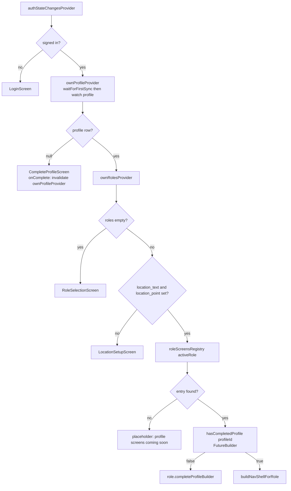

# Auth, Roles and Profile Completion

**Owner:** Author A (Core)
**Reviewers:** Author B, Author C, Author D
**Last verified against:** migrations up to `20260927093935_recurring_orders_rpc.sql`

## 1. Purpose

How a user gets from "no session" to a role-specific home screen: Supabase Auth, the `AuthGate` routing, role registries, and the profile-completion steps that each write different tables.

## 2. Key concepts

- A user has **one `profile`** and **zero or more roles** (`profile_role` rows: `farmer`, `buyer`, `driver`).
- `profile.active_role` says which role the app currently shows; if null, `AuthGate` uses `roles.first`.
- Each role has its own profile table (`farmer_profile`, `buyer_profile`, `driver_profile`) whose FK `(profile_id, role) -> profile_role(profile_id, role)` forces the role to exist first.
- Role behaviour is plugged in through two registries, so `AuthGate` stays role-agnostic.

## 3. Auth gate routing

`activeRole = profile.activeRole ?? roles.first`. `buildNavShellForRole` copies the fallback onto the profile (`copyWith(activeRole: ...)`) so downstream widgets never see null.

## 4. Providers (`lib/core/auth/auth_providers.dart`)

| Provider | Type | Behaviour |
|---|---|---|
| `authServiceProvider` | `Provider<AuthService>` | |
| `authStateChangesProvider` | `StreamProvider<AuthState>` | `supabase.auth.onAuthStateChange` |
| `ownProfileProvider` | `StreamProvider<Profile?>` | Yields null if signed out; otherwise awaits `db.waitForFirstSync()` then `watchOwnProfile()` |
| `ownRolesProvider` | `StreamProvider<List<String>>` | `SELECT role FROM profile_role WHERE profile_id = ?` |

## 5. Data model

| Table | Key columns | Constraints |
|---|---|---|
| `profile` | `id` (= `auth.users.id`), names, `address jsonb`, `phone`, `avatar_url` (storage path), `preferred_language` (`language_code`: en/si/ta), `active_role` (`user_role`), `location_text`, `location_point geography(Point,4326)`, mirrors `active_role_text`, `preferred_language_text`, `location_geojson` | GIST index on `location_point`; `set_updated_at` trigger |
| `profile_role` | `id`, `profile_id`, `role`, `role_text` | `unique(profile_id, role)` |
| `buyer_profile` | `profile_id` PK, `buyer_type` (`individual`/`organization`), `buyer_label` | organization requires label |
| `farmer_profile` | `profile_id` PK, `avg_rating`, `review_count` | rating columns trigger-maintained |
| `driver_profile` | `profile_id` PK | marker row |
| `vehicle` | see [../D-delivery-chat-notifications/driver-assignment.md](../D-delivery-chat-notifications/driver-assignment.md) | |

`address` was a composite type originally and was converted to jsonb (`20260823181803_address_jsonb`); keys are `line1`, `line2`, `city`, `postal_code`. The view `profile_read` (final: EWKT location) is not used by the Dart code in the dump.

## 6. Profile completion steps (which service writes what)

| Step | Service call | Local SQL |
|---|---|---|
| 1. Create profile | `AuthService.createOwnProfile` | `INSERT INTO profile` via `Repository.insert(profile.id, ...)`; `active_role` is never sent on insert |
| 2. Choose role(s) | `AuthService.addRole(role)` | `INSERT INTO profile_role (id, profile_id, role) VALUES (uuid(), ?, ?)` |
| 3. Set active role | `AuthService.setActiveRole` | `UPDATE profile SET active_role` |
| 4. Set location | `AuthService.updateProfileLocation` | `UPDATE profile SET location_point (WKT), location_geojson, location_text` |
| 5a. Buyer | `BuyerProfileService.createProfile` | `buyer_profile` insert (id = profile id) |
| 5b. Farmer | `FarmerProfileService.createProfile(profileId, crops)` | `farmer_profile` insert, then `farmer_crop` rows; crops may be empty |
| 5c. Driver | `DriverProfileService.createProfile(profileId, vehicle, routes)` | `driver_profile`, one `vehicle`, optional routes |

The completion *check* per role (`hasProfile`) is a local existence query. Location comes from `LocationService.fetchCurrentLocation()` (permission checks, 15 s high-accuracy fix, reverse-geocode fallback to `lat, lng` text; failures raise `LocationException(code)` mapped to translation keys).

Side effect at step 1: trigger `trg_notify_welcome_on_profile_created` (`20260902080057`) inserts a `welcome` notification (payload `{"screen":"settings"}`).

## 7. Registries

### `roleScreensRegistry` (`lib/core/roles/role_profile_registry.dart`)

| Key | `hasCompletedProfile` | `completeProfileBuilder` | `viewBuilder` |
|---|---|---|---|
| `buyer` | `BuyerProfileService().hasProfile` | `BuyerCompleteProfileScreen` | `BuyerProfileViewScreen` |
| `farmer` | `FarmerProfileService().hasProfile` | `FarmerCompleteProfileScreen` | `FarmerProfileViewScreen` |
| `driver` | `DriverProfileService().hasProfile` | `DriverCompleteProfileScreen` | `DriverProfileViewScreen` |

### `buildNavShellForRole` (`role_nav_shell_registry.dart`)

| Role | Tabs |
|---|---|
| farmer | Home (`FarmerHomeScreen`), Harvest (`MyListingsScreen`), Orders (`FarmerOrdersScreen`), Chat |
| buyer | Home (= `MarketplaceScreen`), Cart (badge), Orders (`BuyerOrdersScreen`), Chat |
| driver | Home (`DriverHomeScreen`), Calendar (`DriverCalendarScreen`), Deliveries (`DriverDeliveriesScreen`), Chat |

`navShellIndexProvider` holds the selected tab (so pushed routes can switch tabs).

## 8. Auth configuration (`supabase/config.toml`, local dev)

| Setting | Value |
|---|---|
| `enable_signup` / email signup | true |
| `enable_confirmations` | false |
| `minimum_password_length` | 6 |
| `password_requirements` | empty |
| `jwt_expiry` | 3600 |
| `enable_refresh_token_rotation` | true |
| `additional_redirect_urls` | `https://127.0.0.1:3000` only |
| Google provider block | absent (only `[auth.external.apple]`, disabled) |

Client: email/password (`signUp`, `signInWithPassword`) and `signInWithOAuth(google)` with redirect `io.supabase.greenyield://login-callback` on mobile or `Uri.base.origin` on web. Account deletion is not implemented (`delete_account_not_available` string).

> ⚠ Unverified: `common.json` says "Password must be at least 8 characters" while `config.toml` enforces 6. Confirm whether the hosted project's setting and the UI validators differ (validators are UI, not in the dump).

> ⚠ Unverified: `config.toml` has no Google provider config and its redirect allow-list lacks the mobile deep link. Confirm the hosted project settings.

## 9. RLS

`profile`: select/insert/update own; plus `profile_select_order_participants` (see architecture doc warning). `profile_role`: select/insert/delete own (no update). Role profile tables: select/insert/update own. `is_conversation_participant` etc. are chat concerns.

## 10. Offline vs online

Sign-in/sign-up need a connection. After the first sync, gate routing works offline because it reads local tables. First launch offline blocks on `waitForFirstSync()`.

## 11. Edge cases

- Multi-role users: chat threads and unread counts are keyed by the **active role** (see chat doc).
- Sign-out clears the local DB; un-uploaded writes are lost.
- `hasCompletedProfile` runs in a `FutureBuilder` on each build.
- `roleScreensRegistry[activeRole] == null` renders a placeholder text, not an error.

## 12. How to add a role or change routing

1. `alter type user_role add value '<role>'` (and `chat` role check constraints: `conversation_participant.role in ('buyer','farmer','driver')` and RPC validation).
2. New `<role>_profile` table with FK `(profile_id, role) -> profile_role`; follow [add-a-synced-table.md](add-a-synced-table.md).
3. Add `roleScreensRegistry` entry and a `buildNavShellForRole` case (the default case falls back to a Home-only shell).
4. Update role selection UI and any `active_role` mirrors (no change, text).

## Source files

`lib/core/auth/auth_gate.dart`, `auth_providers.dart`, `auth_service.dart`; `lib/core/roles/role_profile_registry.dart`, `role_nav_shell_registry.dart`; `lib/core/location/location_service.dart`; `lib/models/profile.dart`, `buyer_profile.dart`, `farmer_profile.dart`, `driver_profile.dart`; `lib/features/profile/**/**_service.dart`; `lib/features/navigation/presentation/app_nav_shell.dart`; `supabase/config.toml`; `assets/translations/en/common.json`. Migrations: `20260815155858_generic_profile`, `20260817163454_profile_read_view`, `20260817223627_profile_role`, `20260817224144_buyer_profile`, `20260818012120_farmer_profile`, `20260818014236_driver_profile`, `20260823181803_address_jsonb`, `20260902080057_welcome_notification`, `20260915130000_fix_orders_rls_recursion`.