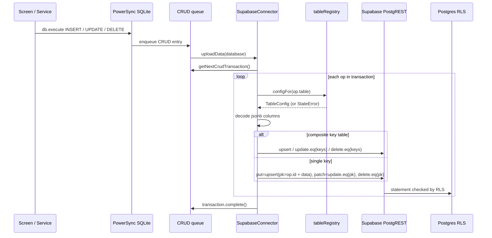

# Data-Access Layer

**Owner:** Author A (Core)
**Reviewers:** Author B (listings, pricing), Author C (orders, wallet), Author D (notifications, delivery)
**Last verified against:** migrations up to `20260927093935_recurring_orders_rpc.sql`, sync-config (path unconfirmed)

## 1. Purpose

Explains how Dart code reads and writes data on the PowerSync path: the global `db`, the generic `Repository<T>`, `TableConfig` / `tableRegistry`, and `SupabaseConnector.uploadData`. For the decision of *which* path a feature uses, see [architecture-overview.md](architecture-overview.md).

## 2. Key concepts

| Concept | File | Role |
|---|---|---|
| `db` | `lib/core/local_db/powersync.dart` | `late final PowerSyncDatabase`, the single local SQLite handle. |
| `schema` | `powersync_schema.dart` | Local table/column definitions (text / real / integer only). |
| `Repository<T>` | `repository.dart` | Generic CRUD + watch over one local table. |
| `TableConfig`, `CompositeKey` | `table_config.dart` | Describes remote PK column, jsonb columns, composite local id. |
| `tableRegistry`, `configFor()` | `table_registry.dart` | Registry consumed by the connector. Throws `StateError` for unregistered tables. |
| `SupabaseConnector` | `powersync_connector.dart` | Provides credentials; uploads the CRUD queue. |

### Local type conventions (from `powersync_schema.dart`)

| Postgres | Local SQLite | Notes |
|---|---|---|
| uuid, text, timestamptz, date, enum | `TEXT` | Enums arrive via `*_text` mirror columns (see [powersync-sync-and-mirrors.md](powersync-sync-and-mirrors.md)). Timestamps are ISO strings. |
| numeric | `REAL` | |
| boolean | `INTEGER` 0/1 | e.g. `is_active`, `is_current`; compare with `= 1` locally. |
| jsonb | `TEXT` (JSON string) | Decoded on upload only for columns listed in `TableConfig.jsonbColumns`. |
| geography | `TEXT` | `location_geojson` (read), `location_point` (write, WKT/EWKT). |
| `id` | `TEXT` primary key | PowerSync adds `id` to every table implicitly. |

## 3. Repository&lt;T&gt;

`Repository<T>({table, fromMap, toInsertMap})`. Filters and writes always use the **local** `id` column; it does not read `tableRegistry`.

| Method | SQL issued | Notes |
|---|---|---|
| `watchOne(id)` | `SELECT * FROM t WHERE id = ?` | Stream of `T?`. |
| `watchAll({where, parameters, orderBy, limit})` | `SELECT * FROM t [WHERE ...] [ORDER BY ...] [LIMIT n]` | `where` / `orderBy` are raw SQL fragments (internal callers only). |
| `exists(id)`, `getOptional(id)` | `SELECT ... WHERE id = ?` | |
| `insert(id, value)` | `INSERT INTO t (id, ...) VALUES (...)` | Caller supplies a stable id (1:1 tables where id == profile id). `toInsertMap` must **not** contain the pk. |
| `insertGenerated(value)` | `INSERT ... VALUES (uuid(), ...)` | Synthetic ids (`vehicle`, `driver_route_preference`). |
| `update(id, value)` | `UPDATE t SET k = ?, ... WHERE id = ?` | Writes every key from `toInsertMap`. |
| `delete(id)` | `DELETE FROM t WHERE id = ?` | |

### Who uses what

| Service | Table(s) | Style |
|---|---|---|
| `AuthService` | `profile` (Repository, strips `id` from `toInsertMap`); `profile_role`, `profile.active_role`, location (raw `db.execute`) | mixed |
| `BuyerProfileService` | `buyer_profile` | Repository (`toInsertMap` includes `profile_id`, redundant with local id) |
| `DriverProfileService` | `vehicle`, `driver_route_preference` (Repository); `driver_profile` (raw) | mixed; `watchOwnProfile` hand-combines two streams |
| `FarmerProfileService` | `crop` (Repository, read-only, `toInsertMap` throws `UnsupportedError`); `farmer_profile`, `farmer_crop` (raw) | mixed; composite id via `configFor('farmer_crop').compositeKey!.buildId(...)` |
| `CartService` | `cart`, `cart_item` | raw SQL, ids via `Uuid().v4()` |
| `ProduceListingService` | `produce_listing` | raw SQL |
| `NotificationService` | `notification` | raw SQL |
| `OrderService`, `FarmerReviewService`, `WalletService`, `DeliveryFeeService`, `MarketPriceService` | read-only local queries | raw SQL |

### Local id conventions

| Table(s) | Local `id` |
|---|---|
| `profile` | auth user id |
| `farmer_profile`, `buyer_profile`, `driver_profile` | profile id (same value also stored in `profile_id`) |
| `farmer_crop` | `"<farmerProfileId>:<cropId>"` (composite, see §6) |
| `vehicle`, `driver_route_preference`, `profile_role` | `uuid()` generated by SQLite |
| `cart`, `cart_item` | `Uuid().v4()` from Dart |
| `produce_listing` | caller-supplied UUID (photo path is keyed by it before insert) |
| server-created tables | server uuid |

## 4. Upload path (`SupabaseConnector.uploadData`)

Operation mapping:

| `UpdateType` | Single-key table | Composite-key table |
|---|---|---|
| `put` | `upsert({remotePkColumn: op.id, ...opData})` | `upsert({...splitId(op.id), ...opData})` |
| `patch` | `update(opData).eq(remotePkColumn, op.id)` | `update(opData)` with one `.eq` per key column |
| `delete` | `delete().eq(remotePkColumn, op.id)` | `delete()` with one `.eq` per key column |

Key facts:
- One PowerSync transaction is processed op by op and `transaction.complete()` is called only at the end.
- `remotePkColumn` exists because `*_profile` tables use `profile_id` as their real Postgres PK while PowerSync still needs a local `id`.
- **`put` is an upsert** (`INSERT ... ON CONFLICT DO UPDATE`), so it needs both INSERT and UPDATE privileges under RLS when the row already exists.
- After a successful upload, Postgres BEFORE triggers recompute the mirror columns (`*_text`, `location_geojson`), which then sync back down.

### Failure behaviour

- `uploadData` has **no try/catch**. An exception (RLS denial, FK violation, `StateError` for an unregistered table) propagates out of `uploadData`.
- Effect on the queue (retry/stall vs. discard) is PowerSync client behaviour and is not visible in this repo.

> ⚠ Unverified: how the PowerSync client handles a repeatedly failing `uploadData` in this app. If it retries indefinitely, one rejected op (e.g. a local write to a table without a write policy) would block every later write. Confirm and decide whether to discard fatal Postgres codes (e.g. `42501`, `23503`) in the connector.

## 5. Registry contents vs. server write permissions

`tableRegistry` is **not** limited to tables the client may write. Registry entries and the final RLS write policies in the migrations:

| Local table | Registry options | Client write policies (final, per migrations) | Notes |
|---|---|---|---|
| `profile` | jsonb: `address` | insert own, update own | no delete |
| `profile_role` | none | select, insert, delete own | **no update policy**, so an upsert over an existing row would be denied |
| `farmer_profile` | pk `profile_id` | select, insert, update own | `avg_rating` / `review_count` are trigger-maintained but not column-protected |
| `farmer_crop` | composite key | select, insert, delete own; update own (added `20260906163834`) | before that migration, edits silently updated zero rows |
| `crop` | none | select all only | registered but read-only |
| `produce_listing` | none | select all; insert, update, delete own | |
| `buyer_profile` | pk `profile_id` | select, insert, update own | `buyer_type = 'organization'` requires `buyer_label` |
| `driver_profile` | pk `profile_id` | select, insert, update own | |
| `vehicle` | none | select, insert, update, delete own | `plate_number` unique; `max_load_kg > 0` |
| `driver_route_preference` | none | select, insert, update, delete own | |
| `cart` | none | select, insert, update own | no delete policy |
| `cart_item` | none | select, insert, update, delete (via own cart) | |
| `notification` | jsonb: `payload` | select, update, delete own | inserts are backend-only |
| `orders` | jsonb: `delivery_address` | select (buyer/farmer, assigned driver) | insert policy dropped in `20260905000001`; no update/delete |
| `order_item` | none | select only | |
| `payment` | none | select (buyer) only | |
| `farmer_review` | none | select public only | writes via `submit_farmer_review` |
| `delivery` | none | select only | |
| `delivery_assignment` | none | select only | |

> ⚠ Unverified: `orders`, `order_item`, `payment`, `farmer_review`, `delivery`, `delivery_assignment` and `crop` are in the registry but have no client write policy. Confirm whether they are registered only so `configFor()` never throws on an accidental write (in which case the write would then fail server-side), or for a purpose not visible in the dump.

### Read-only synced tables NOT in the registry

`wallet`, `wallet_transaction`, `pricing_rule`, `market_price`, `price_trend`, `price_history`, `conversation`, `conversation_participant`, `message` exist in `powersync_schema.dart` (and have sync streams) but not in `tableRegistry`. Any local write to them makes `configFor` throw `StateError` at upload time. This is consistent with them being server-written, but no comment in the code states it as a deliberate rule.

> ⚠ Unverified: confirm the omission is intentional (server-written tables), and that `notification_preference`, which has a sync stream but no local schema table or registry entry, is simply unused.

## 6. Composite keys (`farmer_crop`)

- Postgres PK: `(farmer_profile_id, crop_id)`; there is no `id` column.
- Sync stream builds the local id: `farmer_profile_id || ':' || crop_id AS id`.
- `CompositeKey(['farmer_profile_id', 'crop_id'])`, separator `:`. `buildId([...])` builds the local id; `splitId(id)` throws `FormatException` if the part count is wrong.
- `FarmerProfileService` always builds ids through the registry (`configFor('farmer_crop').compositeKey!.buildId`) and the connector splits them on upload.
- The server view `farmer_crop_read` (fallback image via `coalesce`) is **not** used by the client; the client does the same join locally (`FarmerProfileService.watchOwnProfile`, `CartService.watchCartItems`).

Because UUIDs contain `-` but not `:`, the `:` separator is safe for UUID components.

## 7. Offline vs. online behaviour

| Action | Offline | When back online |
|---|---|---|
| Local write to a registered, writable table | Applied to SQLite immediately, UI updates via `db.watch` | Uploaded in order via `uploadData` |
| Read of synced data | Works | Refreshed by sync streams |
| Cross-user read (marketplace, order detail, driver stops) | Fails (RPC) or falls back (see architecture doc §9) | n/a |
| RPC write (`place_checkout`, `topup_wallet`, ...) | Fails | Must be retried by the user |

Ordering caveat: local cart edits reach the server only after upload, but `place_checkout` validates against the **server** `cart_item` rows (`id` must belong to the buyer's cart and `quantity_kg` must equal the stored value). Checking out immediately after offline cart edits can therefore fail with "Cart item does not belong to buyer" or "Cart item quantity changed". See [../C-orders-payments/cart.md](../C-orders-payments/cart.md).

## 8. Edge cases and failure modes

| Case | Detail |
|---|---|
| Unregistered table written locally | `configFor` throws `StateError('No TableConfig registered for ...')` during upload. |
| jsonb decoding | `_decodeJsonbColumns` only decodes values that are `String`; malformed JSON would throw `FormatException`. |
| Enum columns on upload | Local `active_role`, `preferred_language`, `role`, `status` text is sent to Postgres enum columns; mirror `*_text` columns are then recomputed by triggers. |
| Profile insert | `Profile.toInsertMap()` sends `location_point` as EWKT (`SRID=4326;POINT(lng lat)`); `updateProfileLocation` sends WKT `POINT(lng lat)` plus GeoJSON into `location_geojson`. The trigger `set_profile_powersync_mirrors` recomputes `location_geojson` server-side. |
| FK ordering | `buyer_profile` / `farmer_profile` / `driver_profile` FK to `profile_role (profile_id, role)`. The `profile_role` row must upload before the role profile row; this relies on queue order. |
| Address column | `profile.address` and `orders.delivery_address` are jsonb; `Address.toMap()` uses key `postal_code`. |
| Raw SQL fragments | `Repository` interpolates table names and `where`/`orderBy` text. Only pass compile-time constants. |
| Deleting a listing | The BEFORE DELETE trigger `trg_notify_cart_items_on_listing_delete` inserts `listing_removed_from_cart` notifications (`20260827094812_cross_component_foreign_keys.sql`). |

## 9. How to extend or modify safely

1. **New synced table:** follow [add-a-synced-table.md](add-a-synced-table.md). The registry is only one of several places to touch.
2. **New writable table:** it needs a client INSERT (and UPDATE, because `put` is an upsert) RLS policy, or every upload fails.
3. **Keep `toInsertMap` free of the pk** when using `Repository.insert` / `insertGenerated`.
4. **Do not add local writes for server-owned tables** (orders, wallet, delivery); use RPCs.
5. **Use `remotePkColumn`** whenever the Postgres PK is not `id`.
6. **Consider adding error handling in `uploadData`** before adding more writable tables; a single permanent failure should not silently stop all uploads.
7. Changing a column type on a synced table also requires updating the stream query, `powersync_schema.dart`, and any mirror trigger.

## Source files

- `lib/core/local_db/repository.dart`
- `lib/core/local_db/table_config.dart`
- `lib/core/local_db/table_registry.dart`
- `lib/core/local_db/powersync_connector.dart`
- `lib/core/local_db/powersync.dart`
- `lib/core/local_db/powersync_schema.dart`
- `lib/core/auth/auth_service.dart`
- `lib/features/profile/buyer/buyer_profile_service.dart`
- `lib/features/profile/driver/driver_profile_service.dart`
- `lib/features/profile/farmer/farmer_profile_service.dart`
- `lib/features/cart/cart_service.dart`
- `lib/features/listings/produce_listing_service.dart`
- `lib/features/notifications/application/notification_service.dart`
- sync-config YAML (path unconfirmed)
- Migrations: `20260815155858_generic_profile`, `20260817223627_profile_role`, `20260817224144_buyer_profile`, `20260818012120_farmer_profile`, `20260818014236_driver_profile`, `20260827093107_cart`, `20260827093223_orders`, `20260827092647_harvest_and_listing`, `20260827094812_cross_component_foreign_keys`, `20260829050340_notification_events`, `20260905000001_disable_direct_order_writes`, `20260906163834_farmer_crop_update_policy`, `20260916152234_farmer_review`