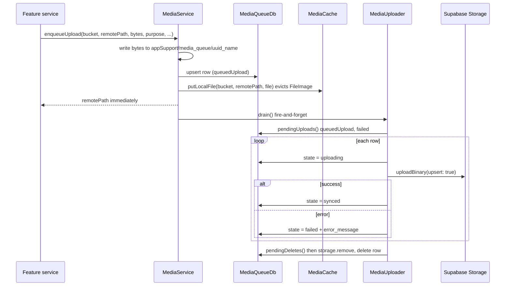

# Media Pipeline

**Owner:** Author A (Core)
**Reviewers:** Author B (listing photos), Author D (chat attachments)
**Last verified against:** migrations up to `20260906082439_crop_fallback_image_storage.sql`

## 1. Purpose

How images are queued, uploaded, cached and displayed. Uploads are **offline-first and independent of PowerSync**: a local sqflite queue drains to Supabase Storage. Rows store storage **paths**, not URLs.

## 2. Components

| Component | File | Role |
|---|---|---|
| `MediaAttachment` / `AttachmentState` | `media_attachment.dart` | Queue row model; states `queuedUpload`, `uploading`, `synced`, `queuedDelete`, `failed` |
| `MediaQueueDb` | `media_queue_db.dart` | sqflite `media_queue.db` (v1), table `media_attachment`, broadcast change stream |
| `MediaService` | `media_service.dart` | `enqueueUpload`, `watchByOwner`, `getDisplayFile`, `invalidateCache`, `deleteAttachment` |
| `MediaUploader` | `media_uploader.dart` | `drain()`, `start()`, `dispose()` |
| `MediaCache` | `media_cache.dart` | Disk cache keyed `bucket:path`, 7-day stale period, 500 objects |
| `AvatarService`, `CropPhotoService` | `lib/core/storage/*` | Path/content-type conventions per purpose |

`media_attachment` columns: `id`, `bucket`, `remote_path`, `local_path`, `owner_id`, `purpose`, `content_type`, `state`, `error_message`, `created_at`, `updated_at`.

## 3. Upload flow

The caller stores `remotePath` in a synced row (`profile.avatar_url`, `farmer_crop.image_url`, `produce_listing.image_url`) right away, so the DB row can sync before the file is uploaded.

## 4. Path and bucket conventions

| Purpose | Bucket | Path | `purpose` string |
|---|---|---|---|
| Avatar | `avatars` (private) | `<userId>/avatar.<ext>` | `avatar` |
| Farmer crop photo | `crop-photos` (private) | `<userId>/<cropId>.<ext>` | `farmer_crop_photo` |
| Listing photo | `crop-photos` | `<userId>/listing_<listingId>.<ext>` | `farmer_crop_photo` |
| Crop fallback image | `crop-fallback-images` (**public**) | `<cropId>.png` | n/a (uploaded by script) |
| Chat attachment | `message-attachments` (private) | `<conversationId>/<uuid>.<ext>` | **not queued** |

Content type derives from extension (`png`, `webp`, else `image/jpeg`). Paths are deterministic, so re-uploads overwrite (`upsert: true`) and `putLocalFile` evicts Flutter's `FileImage` cache. The listing path is keyed by listing id so publishing never overwrites the farmer's standing crop photo.

The three-tier display chain (listing photo, farmer crop photo, crop fallback) spans two buckets, which is why models keep the tiers separate (`displayImage` returns path + bucket + `isFallback`). `20260906163916_fix_marketplace_image_fallback` fixed a bug where the tiers were coalesced server-side and looked up in the wrong bucket.

## 5. Display and cache

`getFile`: cache hit returns the file; otherwise private buckets use `createSignedUrl(path, 3600)`, public buckets use `getPublicUrl` (no network call); then `downloadFile`. `AvatarCacheService` is a thin avatar wrapper.

## 6. Storage RLS (final)

| Bucket | Insert / update / delete | Select |
|---|---|---|
| `avatars` | own folder (`foldername[1] = auth.uid()`) | own **and** any authenticated user (`avatar_select_authenticated`, `20260829211154`) |
| `crop-photos` | own folder | own and any authenticated user |
| `message-attachments` | insert: conversation participant | select: participant |
| `crop-fallback-images` | service role only (public read) | public |

The authenticated-read trade-off is recorded in the migration: any signed-in user can read any avatar/crop photo if they know the path. `config.toml`: `file_size_limit = "50MiB"`. `message-attachments` has no update or delete policy.

## 7. Offline vs online

Enqueue works fully offline; the picked image displays immediately from the seeded cache. Upload happens on `drain()`. `drain()` is re-entrancy-guarded (`_draining`).

## 8. Edge cases and failure modes

| Case | Detail |
|---|---|
| `MediaUploader.start()` never called | Not present in `main.dart`; UI not in dump. Without it, no connectivity listener and no drain at launch. |
| Failed uploads | Marked `failed`, retried on the next `drain()` (next enqueue, or `start()`'s connectivity callback). No backoff, no attempt limit. |
| App killed mid-upload | Row stays `uploading`; `pendingUploads()` only selects `queuedUpload`/`failed`, so it is never retried. |
| Local file cleanup | `_deleteOne` removes the remote object and queue row, not the local file; synced rows and files are never purged in the visible code. |
| Row saved before upload | A synced row can reference a path whose object does not exist yet (or ever, if upload fails). |
| Chat images | Uploaded directly in `ChatService.sendMessage` with `contentType: 'image/$ext'` (so `jpg` becomes `image/jpg`). Fails offline. |
| Signed URL expiry | 1 h; the cache key ignores the URL so rotation is safe. |

> ⚠ Unverified: confirm whether any UI code calls `MediaUploader.instance.start()`, and whether stuck `uploading` rows and orphaned local files matter for the demo.

## 9. How to extend safely

1. Add a thin wrapper like `CropPhotoService` with a `purpose` string; do not edit the generic classes.
2. Add bucket + storage policies in a migration (own-folder pattern), including an update policy if you upload with `upsert: true`.
3. Store the path in a synced column; keep tier-per-bucket separation in the model.
4. Use `deleteAttachment(id)` for removal; call `invalidateCache` after replacing a path.

## Source files

`lib/core/media/*.dart`; `lib/core/storage/avatar_service.dart`, `avatar_cache_service.dart`, `crop_photo_service.dart`; `lib/features/chat/chat_service.dart`; `lib/models/produce_listing.dart`, `marketplace_listing.dart`, `farmer_profile.dart`; `scripts/upload_crop_fallback_images.dart`; `supabase/config.toml`. Migrations: