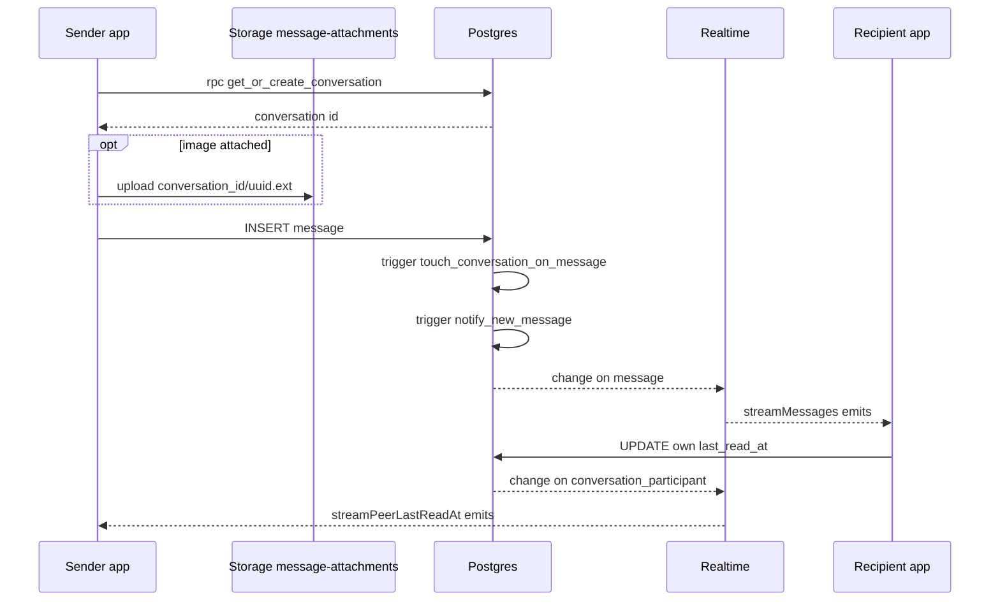

**Owner:** Author D (Delivery, driver, chat, notifications)
**Reviewers:** Author A (sync/RLS/storage)
**Last verified against:** migrations up to `20260927093935_recurring_orders_rpc.sql`

## 1. Purpose

Direct one-to-one messaging between buyer, farmer and driver, with role-aware threads, image attachments, unread badges and a read cursor. The app deliberately reads chat through Supabase Realtime and RPCs (not the PowerSync mirror) for sub-second delivery. Chat needs a connection.

## 2. Key concepts

| Concept | Meaning |
|---|---|
| Direct thread | A `conversation` with `context_type = 'general'`, `order_id` and `journey_id` null, exactly two participants. Only these are listed. |
| Role snapshot | `conversation_participant.role` (`buyer`/`farmer`/`driver`), display name and avatar copied at creation, so a user with several roles gets a separate thread per role pair. |
| Active role | The role the user is currently acting as; passed as `p_active_role` to list/count RPCs. |
| Read cursor | `conversation_participant.last_read_at`; unread = messages from others created after it. There is no per-message read flag. |
| Realtime-only | Reads use `supabase.from(...).stream(primaryKey: ['id'])` and RPCs. |

## 3. Data model

| Table | Columns | Notes |
|---|---|---|
| `conversation` | `id`, `context_type conversation_context` (`order`, `journey`, `general`), `order_id`, `journey_id` (FKs added `20260827094812`), `title`, `created_at`, `updated_at` (added `20260906092841`), mirror `context_type_text` | `order`/`journey` contexts are allowed by RLS but nothing creates them and `get_chat_threads` hides them. |
| `conversation_participant` | `id`, `conversation_id`, `profile_id` (unique together), `joined_at`, `last_read_at`, `display_name`, `avatar_url` (`20260830121221`), `role` (`20260906092841`, check in buyer/farmer/driver) | |
| `message` | `id`, `conversation_id`, `sender_id`, `body`, `attachment_url` (storage path), `attachment_type` (`'image'`), `created_at` | Index `(conversation_id, created_at)` plus later lookup indexes. |
| Storage bucket `message-attachments` | private; object path `<conversation_id>/<uuid>.<ext>` | `20260830104327_message_attachment_storage` |

Indexes added for unread/thread queries: `idx_message_unread_lookup`, `idx_conversation_participant_profile_role_conversation`, `idx_message_conversation_created_sender`.

## 4. Flow

1. **Open/start a thread.** Entry points (e.g. "Message Farmer") call `get_or_create_conversation(callerRole, otherUserId, otherRole)`.
2. **List threads.** `watchChatThreads(activeRole)` calls RPC `get_chat_threads(p_active_role)` and re-runs it when the `conversation` stream or the caller's own `conversation_participant` stream fires (200 ms debounce, request-version guard so an older slow response never overwrites a newer one).
3. **Open a room.** `streamMessages(conversationId)` streams the latest 100 messages (`order created_at desc`, `limit 100`), so the list is newest first. `streamPeerLastReadAt` streams the participant rows of the conversation and returns the other participant's `last_read_at`; the UI derives "seen" by comparing message time to it.
4. **Send.** `sendMessage` optionally uploads the image, then inserts a `message` row (body or attachment required; empty sends return without writing).
5. **Mark read.** `markMessagesAsRead` updates the caller's own `last_read_at` to now (UTC).
6. **Show an image.** `resolveAttachmentUrl` creates a 1-hour signed URL, cached in a static in-memory map.

Provider wiring is in `chat_providers.dart` (`chatThreadsProvider`, `unreadConversationCountProvider`, `chatMessagesProvider`, `peerLastReadAtProvider`; role-keyed families).

## 5. RPCs and triggers

All three RPCs are SECURITY DEFINER, `search_path = public`, granted to `authenticated`.

| RPC | Final definition | Parameters | Behaviour |
|---|---|---|---|
| `get_or_create_conversation(p_caller_role text, p_other_user_id uuid, p_other_role text) returns uuid` | `20260907120353_chat_order_and_unread_refresh` (same body as `20260907112905`) | roles as text | Requires an authenticated caller; both roles in (buyer, farmer, driver) and different; other user is not the caller; both users actually hold their role in `profile_role`. Takes `pg_advisory_xact_lock` on the sorted user pair. Reuses an existing 2-participant general thread that matches **both user ids and both roles**; otherwise inserts the conversation and both participant rows with name/avatar/role snapshots (`trim(concat_ws(' ', first_name, last_name))`). |
| `get_chat_threads(p_active_role text)` | same migration | | One row per direct thread where the caller's snapshot role equals `p_active_role`. Returns `conversation_id, other_user_id, other_role, other_name` (`'Unknown'` if blank), `other_avatar_url, last_message_text, last_message_at, is_last_from_me, has_unread, unread_count, updated_at`. Last message via lateral join; unread from the caller's `last_read_at` (null = epoch). Ordered by `coalesce(latest message time, updated_at) desc, updated_at desc`. |
| `unread_conversation_count(p_active_role text) returns integer` | same migration | | Number of the caller's participant rows for that role with at least one message from someone else after `last_read_at`. Counts threads, not messages. |

Triggers:

| Trigger | Event | Function | Effect |
|---|---|---|---|
| `trg_touch_conversation_on_message` | AFTER INSERT on `message` | `touch_conversation_on_message` (`20260906092841`) | `update conversation set updated_at = now()`. Not SECURITY DEFINER. |
| `trg_notify_new_message` | AFTER INSERT on `message` | `notify_new_message` (`20260829050340`) | One `new_message` notification per other participant, see [notification-events.md](notification-events.md). |
| `trg_conversation_powersync_mirrors` | | `set_conversation_powersync_mirrors` | `context_type_text` |

History of the three RPCs: `20260906092841_chat_system` (no-arg versions) → `20260906135739_chat_thread_unread_count` (adds `unread_count`) → `20260907112905_chat_performance_and_role_fix` (role-aware) → **`20260907120353_chat_order_and_unread_refresh`** (final; only change is the thread ordering). Note the last migration's header comment is a copy of the previous one.

## 6. RLS / permissions

| Object | Policy |
|---|---|
| `conversation` | select: `is_conversation_participant(id)`. insert: `conversation_insert_participant_context` (general always; order/journey only for the order's buyer/farmer or the journey's driver; from `20260827094812`). **No update or delete policy.** |
| `conversation_participant` | select: `is_conversation_participant(conversation_id)` (so both participants see both rows). insert: self, or already a participant. update: own row only (`profile_id = auth.uid()`). |
| `message` | select: participant. insert: `sender_id = auth.uid()` and participant. No update/delete. |
| `is_conversation_participant(uuid)` | SECURITY DEFINER SQL helper (`20260827091748_messaging`). |
| Storage `message-attachments` | insert and select for participants of the folder's conversation; no update/delete. |

## 7. Offline vs online

| Piece | Offline | Online |
|---|---|---|
| Thread list, messages, unread count, send, upload, mark read | Fail (Realtime and RPC) | Work |
| Cached signed URLs | May still be in memory | Refresh after 1 hour |

The three chat tables are also in the PowerSync publication and `powersync_schema.dart` (the schema comment says this is so `new_message` notifications and offline browsing work). The sync streams omit `conversation_participant.role/display_name/avatar_url`, `conversation.updated_at` and `message.attachment_type`, so names cannot actually be rendered offline from the mirror, and the app does not read chat from the mirror anyway.

> ⚠ Unverified: the schema comment promises offline browsing of chat, but the stream columns make that impossible for names/avatars/roles. Decide whether to drop the comment or extend the streams.

## 8. Edge cases and failure modes

> ⚠ Unverified: `touch_conversation_on_message` is not SECURITY DEFINER and `conversation` has no UPDATE policy, so under RLS the `updated_at` update by the sender is likely matched to zero rows. Consequences: `conversation.updated_at` may stay at its creation time; the `conversation` Realtime stream may not fire on new messages; a recipient's thread list might not refresh live for incoming messages (only the caller's own `last_read_at` changes fire the participant stream). The later migration orders by latest message time "even if updated_at is briefly stale", which suggests this was seen. Confirm on a live device.

- **Send failure after upload:** the image is uploaded before the row insert; a failed insert leaves an orphan object (no delete policy).
- **Content type:** upload uses `contentType: 'image/$ext'`, so `.jpg` becomes the non-standard `image/jpg`.
- **Image-only last message:** the final `get_chat_threads` selects only `body`, so `last_message_text` is null for an image-only message (the UI fallback is not in the dump).
- **Legacy participants with null `role`:** the backfill only fills profiles with exactly one role; `ChatThread.fromMap` casts `other_role` to a non-null string and `ChatRole.fromString` throws on unknown values.
- **Same pair, different roles:** produces a separate thread by design.
- **Order/journey conversations:** permitted by RLS but no creator and no UI path.
- **Pagination:** only the latest 100 messages are streamed; older messages are not loadable.
- **`new_message` notifications:** inserted for every message, hidden by the client, still synced (see notification doc).
- **Unread cursor race:** `markMessagesAsRead` uses the client clock; skew can leave a message unread or hide a new one.

## 9. How to modify safely

1. Change RPC bodies with `create or replace` in a new migration; keep the role parameters, or every entry point in Dart must change (`ChatService`, `chat_nav_badge_icon`, `role_nav_shell_registry`).
2. If you fix the touch trigger, make `touch_conversation_on_message` SECURITY DEFINER with `set search_path = public` (do not add a broad UPDATE policy on `conversation`).
3. To add a table to Realtime use `alter publication supabase_realtime add table ...` inside an idempotent `do $$` guard (never drop that publication).
4. If you add `attachment_type` values, update `ChatMessage.isImage`, the storage `contentType` and the thread preview.
5. To support order/journey chats, decide the role-snapshot rules first; `get_or_create_conversation` only matches `general` threads.
6. To send a notification differently, edit `notify_new_message` (see notification doc); keep the client's `type != 'new_message'` filters in sync.

## Source files

`lib/features/chat/chat_service.dart`, `lib/features/chat/application/chat_providers.dart`, `lib/models/chat_models.dart`, `lib/core/roles/role_nav_shell_registry.dart` (Chat tab wiring), `lib/core/local_db/powersync_schema.dart`, sync-config (path unconfirmed) streams `own_conversations`, `own_conversation_participants`, `own_messages`. Migrations: `20260827091748_messaging.sql`, `20260827094812_cross_component_foreign_keys.sql`, `20260829050340_notification_events.sql`, `20260830104327_message_attachment_storage.sql`, `20260830121221_conversation_participant_display_fields.sql`, `20260906092841_chat_system.sql`, `20260906135739_chat_thread_unread_count.sql`, `20260907074658_fix_chat_realtime_publication.sql`, `20260907112905_chat_performance_and_role_fix.sql`, `20260907120353_chat_order_and_unread_refresh.sql`.
