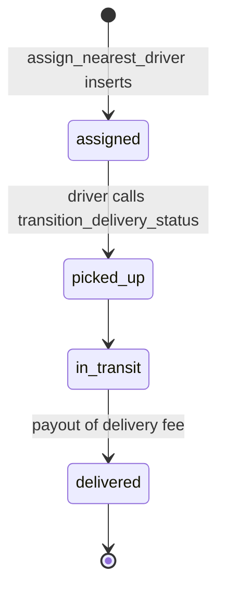

# Delivery Status, Tracking Schema & Driver Payout

**Owner:** Author D (Delivery, driver, chat, notifications)
**Reviewers:** Author C (order state machine, money), Author A (sync/RLS)
**Last verified against:** migrations up to `20260927093935_recurring_orders_rpc.sql`

> **Honesty note:** the delivery *status* flow, delivery RLS and the driver payout are implemented. Live GPS tracking, journeys, routes, route stops and ETA are **schema only**: no code in the dump writes `delivery_tracking`, `journey`, `route` or `route_stop`. The migrations say a trusted Edge Function would create journeys and routes, but no Edge Functions are in the dump.

## 1. Purpose

Describe how a delivery moves through its statuses, how that mirrors onto the order, who can read/write delivery data, how the driver is paid, and which tracking structures exist but are unused.

## 2. Key concepts

| Concept | Meaning |
|---|---|
| Delivery | One row per order (`delivery.order_id` unique). Created by dispatch, see [driver-assignment.md](driver-assignment.md). |
| Assignment | `delivery_assignment` row; the current one has `is_current = true`. History would be kept via `unassigned_at`. |
| Mirror | `transition_delivery_status` updates the delivery, then advances the order through `transition_order_status`. |
| Payout | On `delivered`, the driver's wallet is credited the order's `delivery_fee_amount`. |
| Display-name snapshot | `delivery.farmer_display_name` / `buyer_display_name`, see [../cross-cutting.md](../cross-cutting.md). |

## 3. Data model

| Table | Columns | Status |
|---|---|---|
| `delivery` | `id`, `order_id` UNIQUE (FK `orders`, restrict), `journey_id`, `pickup_location_text`, `pickup_location_point`, `dropoff_location_text`, `dropoff_location_point`, `status delivery_status`, `assigned_at`, `picked_up_at`, `delivered_at`, `farmer_display_name`, `buyer_display_name`, timestamps, mirrors `status_text`, `pickup_location_geojson`, `dropoff_location_geojson` | Used |
| `delivery_assignment` | `id`, `delivery_id`, `driver_profile_id`, `vehicle_id`, `assigned_at`, `unassigned_at`, `is_current` | Used (insert only) |
| `delivery_tracking` | `id`, `delivery_id`, `journey_id`, `location_point geography NOT NULL`, `speed_kmh`, `heading`, `recorded_at`, mirror `location_geojson` | No writer |
| `driver_schedule` | see [driver-assignment.md](driver-assignment.md) | Written by dispatch |
| `journey` | `driver_profile_id`, `vehicle_id`, `journey_date`, `direction` (`outbound`/`return`), `status journey_status` (`planned, in_progress, completed, cancelled`) | No writer |
| `route` | `journey_id` UNIQUE, `estimated_distance_km`, `estimated_duration_minutes` | No writer |
| `route_stop` | `route_id`, `delivery_id`, `stop_type` (`pickup`/`dropoff`), `sequence_number` (unique per route), `location_text`, `location_point`, `planned_arrival_at`, `actual_arrival_at` | No writer |

Enum `delivery_status`: `unassigned`, `assigned`, `picked_up`, `in_transit`, `delivered`. Dispatch inserts rows directly as `assigned`; `unassigned` is never set by any code in the dump.

## 4. Flow

Delivery ↔ order status mapping (full order machine in [../C-orders-payments/order-state-machine.md](../C-orders-payments/order-state-machine.md)):

| Delivery status set | Order status requested | Note |
|---|---|---|
| `assigned` | `assigned` | Dispatch does not use this path (it inserts and transitions the order itself). |
| `picked_up` | `picked_up` | Allowed only if the order is `packed`. |
| `in_transit` | `in_transit` | from `picked_up` |
| `delivered` | `delivered` | from `in_transit` |
| `unassigned` | none | Delivery updated, order untouched. |

Order statuses with no delivery counterpart: `placed`, `confirmed`, `packed` (farmer action via `mark_order_packed`), `completed` (never set), `cancelled`.

## 5. RPCs and triggers

| Object | Definition | Behaviour |
|---|---|---|
| `transition_delivery_status(p_delivery_id uuid, p_new_status delivery_status) returns delivery` | Final `20260916050308_wallet_payment_and_payout`; SECURITY DEFINER; granted `authenticated, service_role` | 1) If `auth.uid()` is not null the caller must be the current assigned driver (`42501` otherwise). 2) Update delivery status and the matching timestamp (`assigned_at`, `picked_up_at`, `delivered_at`). 3) Raise if not found. 4) Map to an order status and call `transition_order_status(..., null, 'auto: delivery status sync')`. 5) If `delivered`, credit the current driver `delivery_fee_amount` via `apply_wallet_transaction(driver, 'payout', fee, 'delivery', delivery_id)` when the fee is greater than 0. |
| `estimate_delivery_eta(p_delivery_id uuid) returns timestamptz` | `20260827094054_delivery_tracking`; `stable`, SECURITY INVOKER | Last tracking ping + straight-line distance to `dropoff_location_point` at the average `speed_kmh` over the last 30 minutes (default 30 km/h). Null without pings or dropoff point. No caller in the dump. |
| `trg_notify_delivery_assignment` | AFTER INSERT on `delivery_assignment` | See [notification-events.md](notification-events.md). |
| Delivery-side notifications on status change | none | |

Everything runs in one transaction: if the order transition is invalid, the delivery update, timestamps and payout roll back together.

Payout details: paid only to the current assignment's driver, only when `delivery_fee_amount > 0`, type `payout`, reference `('delivery', delivery_id)`. Because the second `delivered` call fails on `delivered → delivered` in the order machine, the payout cannot be paid twice. The farmer and platform are not credited (see [../C-orders-payments/money-flow.md](../C-orders-payments/money-flow.md)).

## 6. RLS / permissions

| Table | Select | Write |
|---|---|---|
| `delivery` | `delivery_select_related` (final `20260915130000_fix_orders_rls_recursion`): buyer or farmer of the order (via `orders`), or `is_assigned_driver_for_delivery(id, auth.uid())` | none (server functions only) |
| `delivery_assignment` | `delivery_assignment_select_own` (`driver_profile_id = auth.uid()`) | none |
| `delivery_tracking` | buyer/farmer via delivery→orders, or current assigned driver | INSERT: current assigned driver (`delivery_tracking_insert_assigned_driver`) |
| `driver_schedule` | own | own insert/update/delete |
| `journey` | own | own update only (inserts "by trusted Edge Function") |
| `route`, `route_stop` | via own journey | `route_stop` update via own journey |

Helper functions `is_assigned_driver_for_order(uuid, uuid)` and `is_assigned_driver_for_delivery(uuid, uuid)` are SECURITY DEFINER SQL functions that break the RLS cycle `orders → delivery → orders`; the recursion fix and the policies that depend on them are in `20260915130000_fix_orders_rls_recursion`.

Buyers and farmers cannot read `delivery_assignment`; they get driver and vehicle data through the `get_order_detail` RPC ([../cross-cutting.md](../cross-cutting.md)).
