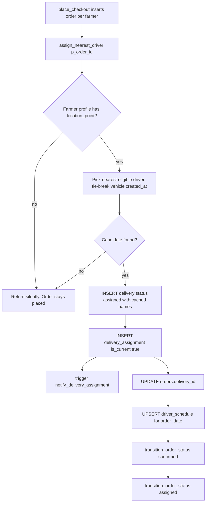

# Driver Assignment & Driver Home

**Owner:** Author D (Delivery, driver, chat, notifications)
**Reviewers:** Author C (checkout/orders), Author A (sync/RLS)
**Last verified against:** migrations up to `20260927093935_recurring_orders_rpc.sql`

## 1. Purpose

At checkout, every per-farmer order is auto-dispatched to the nearest driver. This doc covers the dispatch algorithm, what it writes, the driver's "today" screen data, and the driver's vehicle/route data. Status changes after assignment are in [delivery-tracking.md](delivery-tracking.md) and [../C-orders-payments/order-state-machine.md](../C-orders-payments/order-state-machine.md).

## 2. Key concepts

| Concept | Meaning |
|---|---|
| Dispatch | `assign_nearest_driver(order_id)`, called by `place_checkout` once per order. |
| "Nearest" | Straight-line `ST_Distance` between the driver's `profile.location_point` (home/start point) and the farmer's `profile.location_point`. Not a route. |
| Eligible driver | A `profile` with a `driver_profile` row, a non-null `location_point`, and at least one `vehicle`. |
| Silent no-op | If dispatch cannot proceed the function just returns; checkout still succeeds and the order stays `placed`. |
| Stop | A pickup (at the farmer) or dropoff (at the buyer) shown on the driver's home screen. |

## 3. Data model

| Table | Relevant columns | Written by dispatch |
|---|---|---|
| `delivery` | `order_id` (unique), `pickup_location_point`, `dropoff_location_point`, `farmer_display_name`, `buyer_display_name`, `status`, `assigned_at` | INSERT (`status = 'assigned'`, `assigned_at = now()`) |
| `delivery_assignment` | `delivery_id`, `driver_profile_id`, `vehicle_id`, `is_current` (default true), `assigned_at`, `unassigned_at` | INSERT |
| `orders` | `delivery_id`, `status` | UPDATE `delivery_id`; status `placed → confirmed → assigned` via `transition_order_status` |
| `driver_schedule` | `(driver_profile_id, schedule_date)` unique, `is_available`, `max_capacity_kg` | UPSERT |
| `vehicle` | `vehicle_type` (`three_wheeler, van, lorry, truck, tractor`), `plate_number` unique, `max_load_kg > 0`, `preferred_min_load_kg <= max_load_kg`, `created_at` | read |
| `driver_route_preference` | see below | **not read** |

**Naming trap:** `vehicle.max_load_kg` / `preferred_min_load_kg` are legacy cargo-era column names. The Dart model repurposes them as passenger/seat capacity (`Vehicle.capacity`, `preferredCapacity`). The server copies `max_load_kg` verbatim into `driver_schedule.max_capacity_kg` and never compares it with order weight.

`driver_route_preference`: `origin_location`, `destination_location` (text, required), `origin_lat/lng/place_id`, `destination_lat/lng/place_id`, `direction` (enum `route_direction`: `outbound`, `return`, `both`), `active_days smallint` (bit0 = Mon … bit6 = Sun; 0 = none), `is_active`, `distance_km`, `duration_minutes`. It is stored, synced and editable, but **dispatch ignores it**.

## 4. Flow

Details:

1. Load the order; raise if missing.
2. Read farmer and buyer `location_point` and display names (`trim(first || ' ' || last)`).
3. Farmer location null → return.
4. Select `p.id, veh.id, veh.max_load_kg` ordered by `ST_Distance(p.location_point, farmer_location) asc, veh.created_at asc limit 1`. Ties across different drivers are broken only by vehicle creation time.
5. Insert `delivery` (pickup = farmer point, dropoff = buyer point, which may be null if the buyer has no location; the `*_location_text` columns are left null; `journey_id` null).
6. Insert `delivery_assignment` (fires `trg_notify_delivery_assignment`, which notifies the driver and buyer).
7. Set `orders.delivery_id`.
8. Upsert `driver_schedule` for `coalesce(order_date, placed_at::date, current_date)` with `is_available = true`, `max_capacity_kg = coalesce(existing, vehicle.max_load_kg)`.
9. Auto-confirm then assign the order.

**What dispatch ignores:** `driver_route_preference`, `active_days`, `is_active`, `driver_schedule.is_available`, vehicle capacity vs load, existing workload, the buyer's location, order date vs driver availability.

Permissions: `revoke all ... from public, anon, authenticated; grant execute ... to service_role`. It only runs inside `place_checkout` (SECURITY DEFINER) or from migrations/backfills.

### Migration history (function `assign_nearest_driver`)

| Migration | Change |
|---|---|
| `20260913105709_notify_and_driver_order_access` | Adds `delivery.farmer_display_name/buyer_display_name`; a version that writes names; assigned-driver read policies; richer notify function. Its DDL was later reported as never executed live. |
| `20260913105735_auto_assign_nearest_driver` | Version **without** names; `revoke/grant`; re-wires the call into `place_checkout` (4-arg). |
| `20260913170000_fix_driver_notifications_and_calendar` | Version with names **plus** `driver_schedule` upsert; inlined notification INSERTs. |
| `20260913180000_apply_missing_schema_and_backfill` | Re-applies the columns and RLS policies from `...105709` (idempotent), backfills stuck `placed` orders. Its header also claims to re-apply the `...105735` function rewrite, but the file contains no function DDL. |
| `20260915092115_fix_missing_driver_assignment_on_checkout` | Restores the `perform assign_nearest_driver(...)` call in the 5-arg `place_checkout` (it had been lost by `20260914000000_add_order_date`) and backfills. |
| **`20260915093000_fix_driver_schedule_uses_order_date`** | **Final.** Uses `order_date` for the schedule row; backfills wrongly-dated `driver_schedule` rows. |

## 5. Driver home RPCs

| RPC | Signature | Behaviour |
|---|---|---|
| `get_driver_today_stops` | `(p_driver_id uuid) returns jsonb`, SECURITY DEFINER, `stable`, granted to `authenticated, service_role` | Caller must equal `p_driver_id` unless service role (`auth.uid()` null). Returns a JSON array of stops. Final: `20260916090642_driver_home_today_stops`. |
| `start_driver_shift` | `(p_order_ids uuid[]) returns void`, SECURITY DEFINER, `authenticated` | For each listed order where the caller is the current assigned driver, sends `driver_started_route` to the buyer and to the farmer. No status changes. |

`get_driver_today_stops` rules:

| Stop type | Delivery status filter | Address source | Coordinates |
|---|---|---|---|
| `pickup` (farmer) | `assigned` | farmer `location_text`, else `address->>'line1'` | `ST_Y/ST_X(d.pickup_location_point)` |
| `dropoff` (buyer) | `picked_up`, `in_transit`, `delivered` | buyer `location_text`, else `address->>'line1'`, else `orders.delivery_address->>'line1'` | `ST_Y/ST_X(d.dropoff_location_point)` |

Common filters: `da.is_current`, `orders.status <> 'cancelled'`, `coalesce(o.order_date, (d.assigned_at at time zone 'utc')::date) = current_date`. Output is ordered only by `stop_order` (all pickups, then all dropoffs); `sort_time` is selected but not used to order. Each stop carries names (profile name, falling back to the cached delivery name), phone, crop names, `total_amount`, `order_date`.

> ⚠ Unverified: `current_date` is the database session time zone (normally UTC), while `order_date` is chosen in the buyer's local calendar (Sri Lanka is UTC+5:30). Between 00:00 and 05:30 local time the driver's "today" is the previous UTC date. Confirm the DB `timezone` setting.

## 6. Client

| Class | Behaviour |
|---|---|
| `DriverHomeService.fetchTodayStops` | RPC `get_driver_today_stops`; wrapped by `driverTodayStopsProvider` (autoDispose family; invalidate after actions). |
| `DriverHomeService.startShift(orderIds)` | RPC `start_driver_shift`; skips if the list is empty. |
| `DriverHomeService.confirmPickup(deliveryId)` | **Two RPC calls in two transactions**: `transition_delivery_status(picked_up)` then `(in_transit)`. |
| `DriverHomeService.confirmDropoff` | `transition_delivery_status(delivered)` (also pays the driver, see delivery-tracking). |
| `DriverShiftStartedNotifier` | "Started" flag lives only in `SharedPreferences` key `driver_shift_started_<yyyy-mm-dd>` (device local date). The server does not record a shift. |
| `DriverScheduleService.watchTasksForDriver` | PostgREST embedded select over `delivery_assignment → delivery → orders → order_item → crop`; **yields once** despite the "watch" name; prints debug lines. |
| `DriverTask.dayOf` | day = `order_date` (date part), fallback `assigned_at` local day. `fromDeliveryRow`: pickup task while delivery is `assigned`, else delivery task; time shown is `assigned_at` local time, not a scheduled slot; done when `delivered`. |
| Providers `driverPickupRequestsProvider` etc. | Filter deliveries by status lists `assigned, packed` / `picked_up, in_transit` / `delivered, completed, cancelled`. `packed`, `completed`, `cancelled` are not `delivery_status` values. |

`lib/models/driver_task.dart` still carries stale comments ("no backend table", `sampleDriverTasksFor` placeholder data); the real path is `fromDeliveryRow`.

## 7. RLS / permissions

| Table | Policy |
|---|---|
| `vehicle` | own select/insert/update/delete; plus `vehicle_select_order_participants` (`20260915100000`) |
| `driver_route_preference` | own CRUD |
| `driver_schedule` | own CRUD |
| `driver_profile` | own select/insert/update |
| `delivery`, `delivery_assignment` | see [delivery-tracking.md](delivery-tracking.md) |

## 8. Offline vs online

| Piece | Offline | Online |
|---|---|---|
| Edit vehicle / routes | Works (PowerSync write queue) | Uploads |
| Dispatch | n/a (server, inside checkout) | Runs in `place_checkout` |
| Home stops, start route, pickup, dropoff | Fail (RPC) | Work |
| Driver deliveries list / calendar | Fail (PostgREST, yield once) | Work |

## 9. Edge cases and failure modes

- **No eligible driver / farmer without location:** order remains `placed` with no `delivery`. `mark_order_packed` requires `confirmed` or `assigned`, so the farmer cannot pack it; only cancellation is possible. There is no retry job; earlier backfills were one-shot migrations.
- **Pickup before packed:** the order is `assigned` and `assigned → picked_up` is not allowed, so `transition_delivery_status(picked_up)` raises and rolls back (delivery status update included). The pickup stop still shows.
- **`confirmPickup` half-success:** if the first RPC succeeds and the second fails, the delivery is `picked_up`; retrying `confirmPickup` fails because `picked_up → picked_up` is invalid. `OrderService.markInTransit` exists for the second step alone.
- **`start_driver_shift` twice:** sends duplicate notifications (only the client flag prevents it).
- **`driver_schedule` upsert forces `is_available = true`** even if the driver had marked the day unavailable.
- **Cancelled orders:** `cancel_order` does not touch `delivery`/`delivery_assignment`; `get_driver_today_stops` hides cancelled orders, but `watchDeliveriesForDriver` filters only on delivery status, so cancelled orders can still appear in the driver's pickup list.
- **Vehicle choice:** dispatch assigns the driver's earliest-created vehicle; `get_order_detail` later reads an arbitrary vehicle of that driver (see [../cross-cutting.md](../cross-cutting.md)).
- **Concurrency:** many orders to one region all go to the same nearest driver (no load balancing).

> ⚠ Unverified: `driver_route_preference.direction` is an enum (`route_direction`) with no `*_text` mirror trigger (every other enum synced to the client has one) and is streamed with `SELECT *`. Confirm it replicates correctly.

## 10. How to modify safely

1. Change ranking or eligibility only inside `assign_nearest_driver` (new migration, `create or replace`, re-run the `revoke`/`grant`). Keep the `confirmed → assigned` transitions and the `driver_schedule` upsert.
2. If you start honouring `driver_route_preference`, `active_days` (bit0 = Monday, but Postgres `extract(isodow)` is 1–7 and `extract(dow)` is 0 = Sunday: convert carefully), or `is_available`, document the new rule here and in [../cross-cutting.md](../cross-cutting.md).
3. If `place_checkout` is redefined again, re-check that it still calls `assign_nearest_driver` (this call was silently lost once).
4. If you add reassignment, set the old row's `is_current = false` and `unassigned_at`, insert a new row (this fires the notification trigger again), and update `orders.delivery_id` only if the delivery row changes.
5. Rename the legacy `max_load_kg` columns only together with the Dart `Vehicle` model, `powersync_schema.dart`, the `vehicles` stream and `driver_schedule.max_capacity_kg`.
