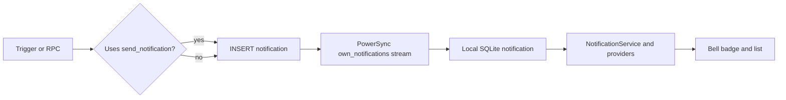

# In-App Notifications (Events & Client)

**Owner:** Author D (Delivery, driver, chat, notifications)
**Reviewers:** Author C (order/payment events), Author A (sync)
**Last verified against:** migrations up to `20260927093935_recurring_orders_rpc.sql`

## 1. Purpose

Backend-generated in-app notifications: which events create rows, what they contain, how they reach the device, and how the client lists and clears them. Only in-app rows exist: no push, SMS or email is sent by anything in the dump.

## 2. Key concepts

| Concept | Meaning |
|---|---|
| Notification row | One `notification` per recipient per event. |
| Producer | A trigger or RPC running as SECURITY DEFINER. Clients never insert. |
| `send_notification(...)` | Helper that inserts a row; `service_role` only. |
| Category | Client-side grouping derived from `type` (no column). |
| Preferences | Table `notification_preference` (channel enum) exists but nothing reads it. |

## 3. Data model

`notification`: `id`, `profile_id` (FK profile, cascade), `type text`, `title text NOT NULL`, `body`, `payload jsonb NOT NULL default '{}'`, `source_table text`, `source_id uuid`, `read_at`, `created_at`. Indexes `(profile_id, created_at desc)` and a partial unread index. Enum `notification_channel`: `in_app`, `push`, `sms`, `email` (used only by `notification_preference`, with mirror `channel_text`).

Locally, `payload` is stored as text; `NotificationItem.fromMap` decodes it, and the upload path decodes it back (`jsonbColumns: {'payload'}` in `tableRegistry`).

## 4. Flow

## 5. Event inventory (final definitions)

| Type | Producer | Migration | Recipient | Payload keys | Client category |
|---|---|---|---|---|---|
| `welcome` | AFTER INSERT on `profile` → `notify_welcome_on_profile_created` | `20260902080057_welcome_notification` | the new user | `screen: 'settings'` | system |
| `listing_removed_from_cart` | BEFORE DELETE on `produce_listing` → `notify_cart_items_on_listing_delete` (direct INSERT) | `20260827094812_cross_component_foreign_keys` | every buyer with the listing in a cart | `produce_listing_id` | system |
| `delivery_assigned` | AFTER INSERT on `delivery_assignment` (only if `is_current`) → `notify_delivery_assignment` (inlined INSERTs) | `20260913170000_fix_driver_notifications_and_calendar` | the driver | `delivery_id`, `order_id` | logistics |
| `order_driver_assigned` | same trigger | same | the buyer | `order_id`, `delivery_id` | orders |
| `payment_received` | AFTER UPDATE on `payment` when status becomes `captured` → `notify_payment_status` | `20260829050340_notification_events` | the buyer | `payment_id`, `order_id`, `amount` | payments |
| `payment_failed` | same, status becomes `failed` | same | the buyer | `payment_id`, `order_id` | payments |
| `refund_processed` | AFTER INSERT on `refund` → `notify_refund` | same | the buyer (from `payment`) | `refund_id`, `payment_id`, `amount` | payments |
| `new_message` | AFTER INSERT on `message` → `notify_new_message` | same | every other participant | `conversation_id`, `message_id` | messages (hidden from the list) |
| `driver_started_route` | `start_driver_shift` RPC | `20260916090642_driver_home_today_stops` | buyer and farmer of each owned order | `order_id` | system |
| `recurring_unfulfilled`, `recurring_skipped_low_balance`, `recurring_fulfilled` | `fulfill_recurring_order` | `20260927093935_recurring_orders_rpc` | the schedule's buyer | `schedule_id` (+ amounts) | system (feature broken, see [../C-orders-payments/recurring-orders.md](../C-orders-payments/recurring-orders.md)) |
| `order_status_changed` | was inside `transition_order_status` | defined `20260829050340`, **removed** by `20260915000000_mark_order_packed` | buyer and farmer | `order_id`, `status` | orders |

`source_table` values used: `profile`, `produce_listing`, `delivery`, `orders`, `payment`, `refund`, `message`, `recurring_schedule`. Bodies are English strings hard-coded in SQL. Some bodies: message text `left(coalesce(body,'Sent an attachment'),140)`; refund text says the refund was issued to the wallet.

Which real actions raise a payment event: wallet checkout inserts the payment `pending` then updates it to `captured` (fires `payment_received`); `simulate_card_payment_capture` fires the same. Nothing sets `failed`; `process_refund` is service-role only and nothing calls it, so `payment_failed` and `refund_processed` are currently unreachable from the app.

Not notified at all: new order to the farmer, order packed, picked up, delivered, cancelled, wallet top-up, driver payout, review received.

`send_notification(p_profile_id, p_type, p_title, p_body default null, p_payload default '{}', p_source_table default null, p_source_id default null) returns notification`: SECURITY DEFINER, `search_path = public`, `revoke all ... from public, anon, authenticated`, `grant execute ... to service_role` (`20260829050340`).

> ⚠ Unverified: `20260913170000` replaced `send_notification` calls with inlined INSERTs, arguing the definer trigger could not call a `service_role`-only function. `notify_payment_status`, `notify_refund`, `notify_new_message`, `notify_welcome_on_profile_created` and `start_driver_shift` still call it. Confirm on the live DB that these notifications are actually created.
