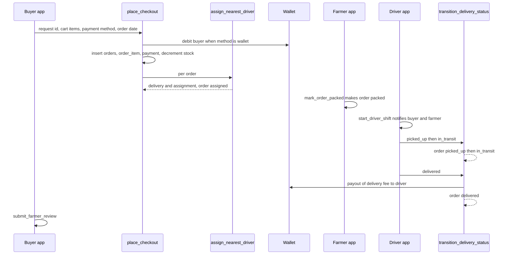

# Cross-Cutting Topics

**Owner:** Multiple (primary owner per topic below)
**Reviewers:** Multiple
**Last verified against:** migrations up to `20260927093935_recurring_orders_rpc.sql`

## 1. Purpose

Topics that span authors' areas. Each section gives a primary owner, secondary reviewers, the flow, files/migrations and pitfalls. Deep dives live in the per-area docs linked from each section.

## 2. End-to-end sequence

