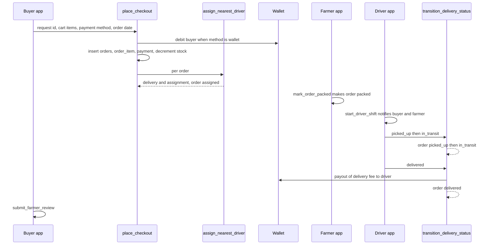

# Cross-Cutting Topics

**Owner:** Multiple (primary owner per topic below)
**Reviewers:** Multiple
**Last verified against:** migrations up to `20260927093935_recurring_orders_rpc.sql`

## 1. Purpose

Topics that span authors' areas. Each section gives a primary owner, secondary reviewers, the flow, files/migrations and pitfalls. Deep dives live in the per-area docs linked from each section.

## 2. End-to-end sequence

## 3. Topics

### 3.1 `get_order_detail` (Owner: Author C; reviewers: A, D)

| Item | Detail |
|---|---|
| Final definition | `20260915120000_fix_get_order_detail_rpc` (the first version `20260915110000` lacked `where oi.order_id = p_order_id`, so its item list covered all orders) |
| Type | `get_order_detail(p_order_id uuid) returns jsonb`, SECURITY DEFINER, `stable`, `authenticated` |
| Access | caller is the order's buyer or farmer, or the current assigned driver (`42501` otherwise; `P0002` if the order does not exist) |
| Returns | order core (status, dates, amounts, `delivery_address`), items (name, quantity, price, `image_url` = listing → farmer_crop → crop fallback), farmer and buyer name and phone, delivery id and status, driver name and phone, vehicle type and plate. **Farmer address is not included** (Dart passes `farmerAddress: null`). |
| Client | `OrderService.watchOrderDetail`: the local `orders`/`delivery` watch is only a change trigger; each emission calls the RPC; on RPC failure it falls back to `_fetchOrderDetailLocally` if a local row exists. |
| List enrichment | `_enrichOrderSummaries` calls the RPC once per uncached order for the first item image (static cache `_firstImageUrlCache`), sequentially, on every list emission: N RPCs. Failures are swallowed. |

Pitfalls: N+1 RPC per list; the local fallback shows `'Buyer'`/`'Farmer'` because display names are not synced and only the own profile row exists locally; the vehicle is read with `where driver_profile_id = ... limit 1` (any vehicle of the driver, not `delivery_assignment.vehicle_id`); phones of all parties are returned to all three participants.

> ⚠ Unverified: a driver with several vehicles may be shown the wrong vehicle in order detail.

Files: `lib/features/orders/order_service.dart`, `order_detail_models.dart`, `20260915110000_get_order_detail_rpc.sql`, `20260915120000_fix_get_order_detail_rpc.sql`.

### 3.2 Driver auto-assignment at checkout (Owner: Author D; reviewers: C, A)

`place_checkout` calls `assign_nearest_driver(order_id)` for each per-farmer order inside the same transaction, so an exception in dispatch rolls back the whole checkout, while a "no driver" outcome does not. Full logic and history: [D-delivery-chat-notifications/driver-assignment.md](D-delivery-chat-notifications/driver-assignment.md). The call was lost once (`20260914000000`) and restored in `20260915092115`; re-verify it after every `place_checkout` rewrite. An unassigned order stays `placed` and the farmer cannot pack it (`mark_order_packed` needs `confirmed`/`assigned`).

### 3.3 Denormalised display names on `delivery` (Owner: Author D; reviewers: A)

| Item | Detail |
|---|---|
| Columns | `delivery.farmer_display_name`, `delivery.buyer_display_name` |
| Why | At the time, `profile` RLS was own-row only, so drivers could not read farmer/buyer names; the cache avoids widening profile reads |
| Written by | `assign_nearest_driver` (`20260913170000`, final `20260915093000`) |
| DDL history | added in `20260913105709`; reported as never executed on the live DB and re-applied by `20260913180000` |
| Consumers | PostgREST embedded selects (`watchDeliveriesForDriver`, `DriverScheduleService`), `get_driver_today_stops` fallback, local SQL fallbacks |

Pitfall: the columns are in `powersync_schema.dart` but not in the sync-config `own_deliveries_*` streams, so the local mirror never has them. Names are snapshots and do not follow later profile edits.

### 3.4 Notifications fired by order/delivery/wallet events (Owner: Author D; reviewers: C)

See [D-delivery-chat-notifications/notification-events.md](D-delivery-chat-notifications/notification-events.md). Fired today: `delivery_assigned`, `order_driver_assigned`, `payment_received` (wallet checkout or simulated card capture), `driver_started_route`. **Lost:** `order_status_changed`, defined in `20260829050340`, dropped when `20260915000000` replaced `transition_order_status` without notifications. Never fired: any farmer new-order alert, cancel, packed, delivered, payout or top-up event.

### 3.5 RLS widening for orders (Owner: Author A; reviewers: C, D)

| Object | Final definition | Rule |
|---|---|---|
| `orders_select_assigned_driver` | `20260915130000` | `is_assigned_driver_for_order(id, auth.uid())` |
| `order_item_select_assigned_driver` | `20260915130000` | `is_assigned_driver_for_order(order_id, auth.uid())` |
| `delivery_select_related` | `20260915130000` | buyer/farmer via orders, or `is_assigned_driver_for_delivery(id, auth.uid())` |
| `profile_select_order_participants` | `20260915130000` | see warning |
| `vehicle_select_order_participants` | `20260915100000_widen_profile_rls_for_orders` | vehicle of a current assignment, if caller is buyer, farmer or driver of the order |
| `is_assigned_driver_for_order/_delivery` | `20260915130000` | SECURITY DEFINER SQL helpers, `authenticated, service_role` |

Why the recursion fix: `orders → delivery → orders` policy cycle raised `42P17`; helpers evaluate outside RLS. The first `profile_select_order_participants` (`20260915100000`) let participants read counterpart profiles, including the driver's; the final version dropped that and added the clause below.

> ⚠ Unverified (security): the final `profile_select_order_participants` second clause is `exists (select 1 from delivery_assignment da where da.driver_profile_id = auth.uid() and da.is_current)`. It is not tied to `profile.id`, so any driver with a current assignment can read every `profile` row (names, phone, address) through the API. PowerSync streams are unaffected (they bypass RLS).
> ⚠ Unverified: `vehicle_select_order_participants` queries `delivery_assignment` under the caller's RLS, and that table only lets the driver see own rows; the buyer/farmer branch is probably ineffective.

### 3.6 `place_checkout` as the single write path (Owner: Author C; reviewers: B, D)

`orders_insert_buyer` was dropped in `20260905000001`; `order_item`, `payment` never had client insert policies. The final function is `place_checkout(uuid, jsonb, text, jsonb, date)` in `20260916050308_wallet_payment_and_payout` (dynamic fee, wallet debit + capture, dispatch). A legacy 4-arg overload from earlier migrations may still exist (no `drop function`). Details: [C-orders-payments/checkout-rpc.md](C-orders-payments/checkout-rpc.md). `orders`, `order_item`, `payment`, `delivery`, `delivery_assignment`, `farmer_review` are in `tableRegistry` although no client write can succeed; never write them locally.

### 3.7 Status/enum mirroring and stream mismatches (Owner: Author A)

Enum and geography columns get text/GeoJSON mirror columns through BEFORE triggers (created by the "powersync_compat_view" migrations, which create no views); sync streams alias them (`status_text as status`).

| Table | Mirror columns | Defined in |
|---|---|---|
| `profile` | `active_role_text`, `preferred_language_text`, `location_geojson` | `20260823070036`, `20260827094859` |
| `profile_role` | `role_text` | `20260830035655` |
| `crop`, `buyer_profile`, `vehicle` | `category_text`, `buyer_type_text`, `vehicle_type_text` | `20260827094859` |
| `conversation`, `notification_preference` | `context_type_text`, `channel_text` | same |
| `produce_listing` | `status_text` | same |
| `orders` | `status_text`, `delivery_location_geojson` | same |
| `order_status_history`, `payment`, `refund_request`, `wallet_transaction` | `status_text` / `method_text` / `type_text` | same |
| `recurring_order`, `journey`, `route_stop`, `delivery`, `delivery_tracking` | frequency/status/stop-type/GeoJSON mirrors | same |
| `refund` | `refund_type_text` | `20260830035655` |
| **No mirror** | `driver_route_preference.direction`, `recurring_schedule.status`, `payment_transaction.status` (text already) | |

Known stream vs Dart schema gaps: `orders.order_date` and `orders.source` not streamed (local `order_date` is null); `delivery` display names; chat participant role/name/avatar, `conversation.updated_at`, `message.attachment_type`; `marketplace_listings` only `status_text = 'active'` (sold-out rows vanish locally); `own_recurring_orders` selects dropped columns; streams for `journey`, `route`, `route_stop`, `delivery_tracking` have no local table. Full list: [A-core/powersync-sync-and-mirrors.md](A-core/powersync-sync-and-mirrors.md).

### 3.8 Order status vs delivery status (Owner: Author C; reviewers: D)

Mapping table and delivery state diagram: [D-delivery-chat-notifications/delivery-tracking.md](D-delivery-chat-notifications/delivery-tracking.md); order machine: [C-orders-payments/order-state-machine.md](C-orders-payments/order-state-machine.md). Key rule: delivery `picked_up` requires order `packed` (farmer action), delivery `delivered` leaves the order at `delivered` (no `completed`), and the delivery update rolls back if the order move is invalid.

### 3.9 Comment vs actual migration filename (Owner: Author A; all reviewers)

| Where the wrong name appears | Comment says | Actual file |
|---|---|---|
| `powersync_schema.dart`, `driver_task.dart` | `20260913090000_notify_and_driver_order_access` | `20260913105709_notify_and_driver_order_access.sql` |
| `powersync_schema.dart`, `farmer_review.dart` | `20260916120000_farmer_review` | `20260916152234_farmer_review.sql` |
| `notification_service.dart`, `notification_item.dart` | `20260829120000_notification_events` | `20260829050340_notification_events.sql` |
| `driver_stop.dart` | `20260916210000_driver_home_today_stops` | `20260916090642_driver_home_today_stops.sql` |
| SQL comment in `20260916050308` | `20260915020000_dynamic_delivery_fee_checkout` | `20260915190815_dynamic_delivery_fee_checkout.sql` |
| SQL comment in `20260906135739` | `chat_system migration (20260906000000)` | `20260906092841_chat_system.sql` |

Always cite the actual filename from `supabase/migrations/`.

### 3.10 Money: farmer and platform are not credited (Owner: Author C; reviewers: D)

Buyer pays `subtotal + delivery_fee + tax` per order; wallet checkout debits it at once and captures the payment. Only the delivery fee is later paid out (to the driver, on `delivered`). The farmer's subtotal, the 2% tax and any platform commission never reach any wallet; there is no platform account or settlement job; card payments stay `pending` unless the demo `simulate_card_payment_capture` is called (no ledger effect); tax is not stored separately; refunds exist as `process_refund` (service role) but nothing calls it and `cancel_order` does not refund. See [C-orders-payments/money-flow.md](C-orders-payments/money-flow.md).

### 3.11 Locations and time zones (Owner: Author B; reviewers: A, C, D)

| Use of `profile.location_point` | Where |
|---|---|
| Marketplace distance | search RPCs take the buyer's lat/lng from the client and the farmer's stored point |
| Delivery fee | `place_checkout` reads buyer and farmer points; fee is 0 if either is missing |
| Dispatch | driver home point vs farmer point |
| Driver stops | `delivery.pickup/dropoff_location_point` copied from those profiles at dispatch time |

Time zones: `orders.order_date` defaults to `now()::date + 1` in the DB time zone; the app sends the buyer's local calendar date; `get_driver_today_stops` compares with `current_date` (DB zone); `refresh_market_price_analytics` runs at 01:00 DB time for `current_date`; `placed_at::date` casts also use the DB zone.

> ⚠ Unverified: DB `timezone` versus Sri Lanka (UTC+5:30); an order dated "today" may not show on the driver's home between 00:00 and 05:30 local time.

## 4. How to modify safely

1. When you redefine any function listed here, grep the migrations for earlier definitions and diff the whole body: several regressions came from copy-pasting an old body (`place_checkout` twice, `transition_order_status`).
2. After any RLS change on `orders`, `delivery`, `profile` or `vehicle`, test buyer, farmer and driver access with the PostgREST API, not only the SQL editor.
3. Keep this file and the per-area docs in step: change both in the same PR.

## Source files

`lib/features/orders/order_service.dart`, `order_detail_models.dart`, `checkout_service.dart`, `driver_home_service.dart`, `lib/core/local_db/powersync_schema.dart`, `table_registry.dart`, sync-config (path unconfirmed). Migrations: `20260827094859_powersync_compat_view.sql`, `20260830035655_powersync_compat_publication_updates.sql`, `20260905000001_disable_direct_order_writes.sql`, `20260913105709_notify_and_driver_order_access.sql`, `20260913170000_fix_driver_notifications_and_calendar.sql`, `20260913180000_apply_missing_schema_and_backfill.sql`, `20260914000000_add_order_date.sql`, `20260915000000_mark_order_packed.sql`, `20260915092115_fix_missing_driver_assignment_on_checkout.sql`, `20260915093000_fix_driver_schedule_uses_order_date.sql`, `20260915100000_widen_profile_rls_for_orders.sql`, `20260915110000_get_order_detail_rpc.sql`, `20260915120000_fix_get_order_detail_rpc.sql`, `20260915130000_fix_orders_rls_recursion.sql`, `20260915165125_schedule_market_price_refresh.sql`, `20260915190815_dynamic_delivery_fee_checkout.sql`, `20260916050308_wallet_payment_and_payout.sql`, `20260916090642_driver_home_today_stops.sql`, `20260916152234_farmer_review.sql`.